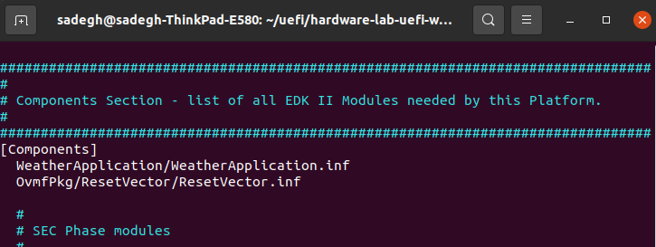
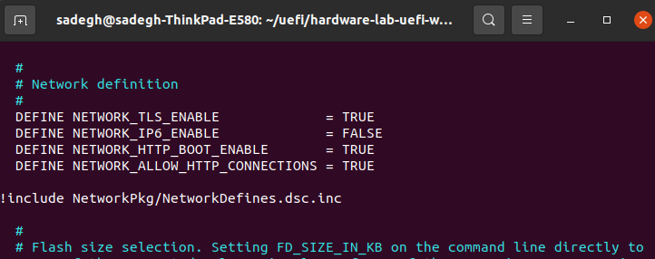
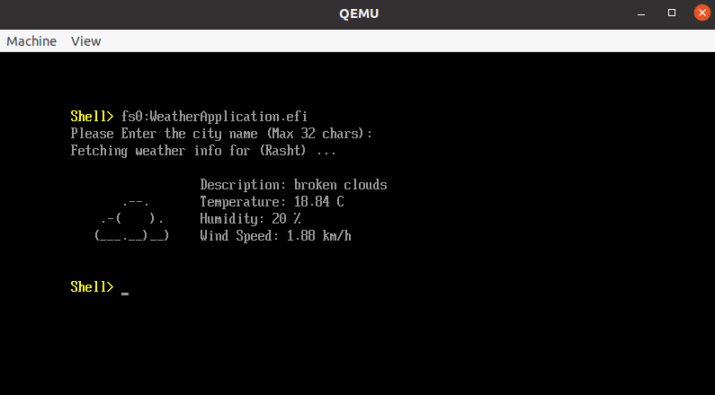
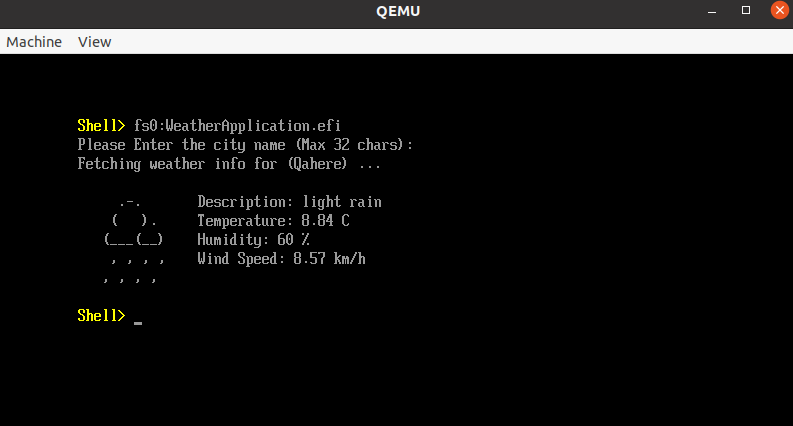
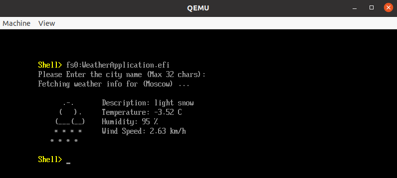
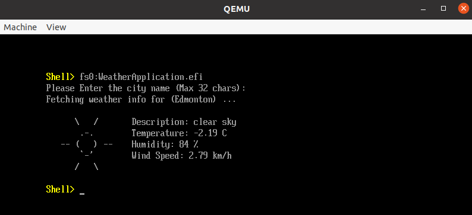
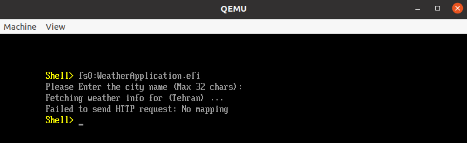
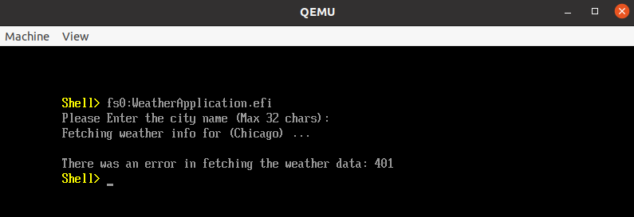

# UEFI Weather APP

This project is part of the Hardware Lab (**CE-40102**) course, featuring a UEFI application designed to display weather information and forecasts for users. The primary focus lies in the ability to interact with a network interface card (**NIC**) within the UEFI environment and initiate a simple **HTTP** request using the tools provided by **EDK II**, the standard UEFI implementation. This project serves as an excellent learning opportunity for working with the fundamentals of the UEFI environment and stands as a valuable reference for those seeking to utilize network interfaces within this setting. The resulting application serves as a convenient tool for users to check the weather upon turning on their computers.


## Tools
Some of the tools and technologies that our project mostly relies on are listed below:
- **Qemu**
- **EDK2**
- **OVMF**
- **KVM**
- `C`
- `Python`


## Implementation Details

Detailed explanations of implementations can be found in this [section](Code/Readme.md).

There is also a comprehensive [report](Document/Readme.md) (in **PDF**) for this project that outlines the steps and challenges encountered.

## How to Run

### Prerequisites

Before starting our work, we need to install several packages and tools to build and run our program successfully.

Install the following packages using apt:

```bash
  sudo apt install gcc build-essential uuid-dev iasl nasm python-is-python3
```

### Install Qemu

To run our program on a simulator, the first step is to install **Qemu**. This tool allows us to conduct experiments on UEFI without directly interacting with hardware, saving both time and resources. On an Ubuntu operating system, you can install **Qemu** using the official apt repository, although this may provide an older version depending on your Ubuntu release. Alternatively, you can manually build it from the source, granting access to a wide range of releases.


To install **Qemu** and **OVMF** (a port of Intel’s tianocore firmware to the qemu virtual machine) using apt:

```bash
  sudo apt install qemu-system ovmf
```

Or by building it from source:

```bash
  wget https://download.qemu.org/qemu-8.2.0.tar.xz
  tar xvJf qemu-8.2.0.tar.xz
  cd qemu-8.2.0
  ./configure
  make
```

**Note:** Building **Qemu** from source code may require different versions of **gcc**, **nasm**, or **iasl**, depending on its release version. To ensure a successful build, it's important to install the correct versions of these requirements. You can refer to the [**Qemu** documentation](https://www.qemu.org/docs/master/) for more detailed information.

### Prepare EDK II and OVMF

First, create a working directory and git clone the **EDK II** repository inside it:

```bash
  mkdir ~/uefi && cd ~/uefi
  git clone https://github.com/tianocore/edk2
  cd edk2
```

Afterwards try to set up a build environment. We used the edk2-stable201911 version of **EDK II** to build our application. Building using the newest version (2023) had some errors. running it on a **Qemu** simulator in Ubuntu gave us nothing and just showed an empty screen for a very long time. We also tried to run it in Fedora but it was not successful. It may be of the incompatibility between **Qemu** and **EDK II** versions and building a newer version of **Qemu** resolves this issue.

```bash
  git checkout edk2-stable201911
  git submodule update --init
  make -C BaseTools
  source ./edksetup.sh
```

Now, we are prepared to build our UEFI Weather application. Initially, we copy our codes and other build-related files (the contents of the [Code/UEFI Weather APP/](Code/UEFI%20Weather%20APP/) directory) to a directory named `WeatherApplication` within the root of the EDK II project. Subsequently, we add the entry `WeatherApplication/WeatherApplication.inf` to the `OvmfPkg/OvmfPkgX64.dsc` file below the [Components] section. This informs the system that our project should be included in the build when executing a build for **OVMF**. It's worth noting that we can independently build our project using `WeatherApplication/WeatherApplication.dsc` as the build target without the need to rebuild **OVMF**. However, building our APP alongside **OVMF** ensures that changes made in both targets stay synchronized. To enable the use of **HTTP** and **TLS** in our **OVMF** image, we should also set their corresponding variables inside the `OvmfPkgX64.dsc` file, specifically `NETWORK_TLS_ENABLE` and `NETWORK_HTTP_BOOT_ENABLE`, to `TRUE`.

```bash
  mkdir WeatherApplication
  cp /path/to/UEFIWeatherAPPDir WeatherApplication/
  vim OvmfPkg/OvmfPkgX64.dsc
```




### Build OVMf and Weather APP

We execute the following commands to build the **OVMF** image and our project's EFI file. The export command is used to ensure that the build utilizes **python3.8** and not other incompatible versions of Python. The `--platform` flag is set to specify the dsc target file for the build. The `--arch` flag determines the underlying hardware architecture for the build. The `--tagname` flag specifies the toolchain for building. The `--buildtarget` flag sets the type of build target, either **RELEASE** or **DEBUG**. The `-D` flag is used to define macros for our build, helping to enable **HTTP** and **TLS**-related variables if we haven't set them to `TRUE` in the dsc file.

```bash
  export PYTHON_COMMAND=/usr/bin/python3.8
  build --platform=OvmfPkg/OvmfPkgX64.dsc --arch=X64 --tagname=GCC5 --buildtarget=DEBUG -D NETWORK_HTTP_BOOT_ENABLE -D NETWORK_TLS_ENABLE
```
We can simplify the build process by creating a permanent configuration file named `target.txt` inside the `Conf` directory in the **EDK II** root. All of these flags can be permanently set using the following command:

```bash
  echo 'ACTIVE_PLATFORM       = OvmfPkg/OvmfPkgX64.dsc
TARGET                = DEBUG
TARGET_ARCH           = X64
TOOL_CHAIN_CONF       = Conf/tools_def.txt
TOOL_CHAIN_TAG        = GCC5
BUILD_RULE_CONF = Conf/build_rule.txt' > Conf/target.txt
  source ./edksetup.sh
```

### Run the weather app on Qemu

Before starting **Qemu**, create a directory to serve as the disk for your simulated machine. Place the **EFI** program inside this disk. Additionally, write a file named "[startup.nsh](Code/startup.nsh)", which the UEFI shell uses for executing commands during initialization. We use this file to configure the network interface **eth0** in our UEFI environment and assign an IP to it using the `dhcp` and `ifconfig` commands.

```bash
  mkdir disk
  cp Build/OvmfX64/DEBUG_GCC5/X64/WeatherApplication.efi disk
  echo 'connect
  ifconfig -r eth0
  ifconfig -s eth0 dhcp
  ifconfig -l eth0' > disk/startup.nsh
```

Now, we are ready to start **Qemu** and run our program. We introduce our customized **OVMF** image as the UEFI firmware for our machine using the `-drive` flag. Similarly, we designate the disk directory as the disk drive for our machine using the same flag. If you prefer not to use the **Qemu** graphical interface, you can also append a `-nographic` flag to the end of this command.

```bash
  qemu-system-x86_64 -drive if=pflash,format=raw,readonly,file=Build/OvmfX64/DEBUG_GCC5/FV/OVMF_CODE.fd -drive format=raw,file=fat:rw:disk
```

After everything is loaded and initialized (ensure that the commands in [startup.nsh](Code/startup.nsh) are executed successfully) and the shell is ready, type the following command in the UEFI shell to start the weather application:

```shell
  fs0:WeatherApllication.efi
```

You can then enter the name of a city you wish to check its weather status, and the program will print a brief report before exiting.

### Build and Run the Weather API

It is necessary to have **Docker** and **Docker Compose** installed on your system. If you require assistance, please refer to the related links section at the end of this document for installation instructions. For the convenience of building and running this API, we have provided a **Docker Compose** file. Create a `.env` file with the following content next to the compose file:

```env
SECRET_KEY=KEY
DEBUG=True
OPEN_WEATHER_MAP_API_TOKEN=Token
MAP_BOX_API_TOKEN=Token
USER_API_TOKEN=Token
```

Once done, navigate to the directory where this file resides in the project and execute the following command in your shell:

```bash
  docker-compose up -d
```

The API is now running on port number `1339` on your system. Keep in mind that you need to generate proper **OpenWeatherMap** and **MapBox** API access tokens, along with your personalized secret key and auth token, for the API to function correctly.

## Results
Here, you can observe the results of running our UEFI Weather APP on **Qemu** (version: 4.2.1, 2019). The program is built using **EDK II** (tag version: edk2-stable201911). The following four pictures depict the successful execution of this program in the UEFI shell:






There are also situations where errors may arise, such as difficulties in finding the network interface or issues in communicating with the API. Our program is designed to handle most known possible errors effectively. The following two pictures illustrate these scenarios and demonstrate how we manage to address them. In the first case, we neglected to execute network configuration commands (as shown in [startup.nsh](Code/startup.nsh)) before running our program, which is necessary to prepare the UEFI shell to communicate with the **NIC**. On the other hand, in the second case, we failed to provide the correct access token for our weather API, resulting in access being denied.




## Related Links

 - [**EDK II**](https://github.com/tianocore/edk2)
 - [**Qemu**](https://www.qemu.org/docs/master/)
 - [**Django Doc**](https://docs.djangoproject.com/en/5.0/)
 - [**Docker Install**](https://docs.docker.com/engine/install/ubuntu/)
 - [**Docker-Compose Install**](https://www.digitalocean.com/community/tutorials/how-to-install-and-use-docker-compose-on-ubuntu-20-04)


## Authors

- [*Mohammad Sadegh Majidi Yazdi*](https://github.com/sadegh-majidi)
- [*Mahdi Jafari Raviz*](https://github.com/mahdi-jfri)
- [*Solale Mohammadi*](https://github.com/solale427)
